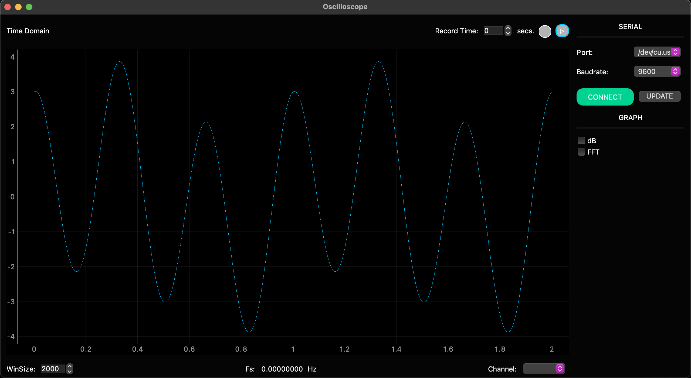

# Oscilloscope
An oscilloscope program to use with arduino, based on PyQt5 and Serial.



# Install
First you probabily want to create a virtual env:
```
python3 -m venv venv
```
After you must to install the dependencies:
```
# Load virtual env
source venv/bin/activate

# Install dependencies
pip install -r requirements.txt

```
# Run
To run the program you must execute the following command:
```
python3 run.py
```
# License
MIT